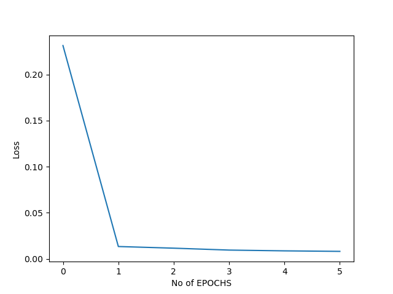
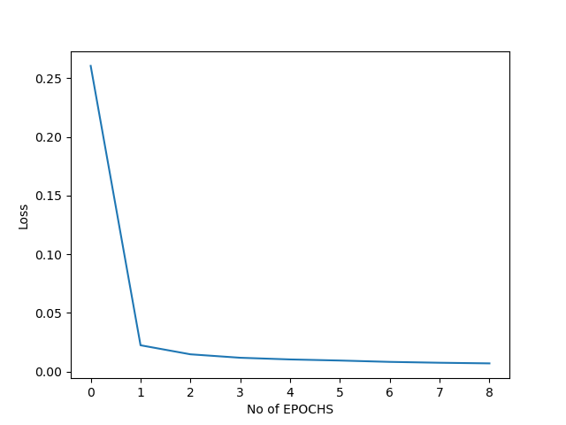

# Autoencoders MNIST Project

#### This is a repository demonstrating a vanilla Autoencoder using MNIST dataset.

#### Autoencoders are used for creating a compressed representation of the given data while retaining the original quality of the data.

#### Here are some examples generated using the model given in code:

Network Type | Fully Connected Layers            | Convolution Neural Networks
:----------------|----------------|----------------:
Original |  | 
Reconstructed |  | 

#### Here are the Loss graphs for Fully connected Layers:

#### Here are the Loss graphs for Convolutional Neural Networks:

